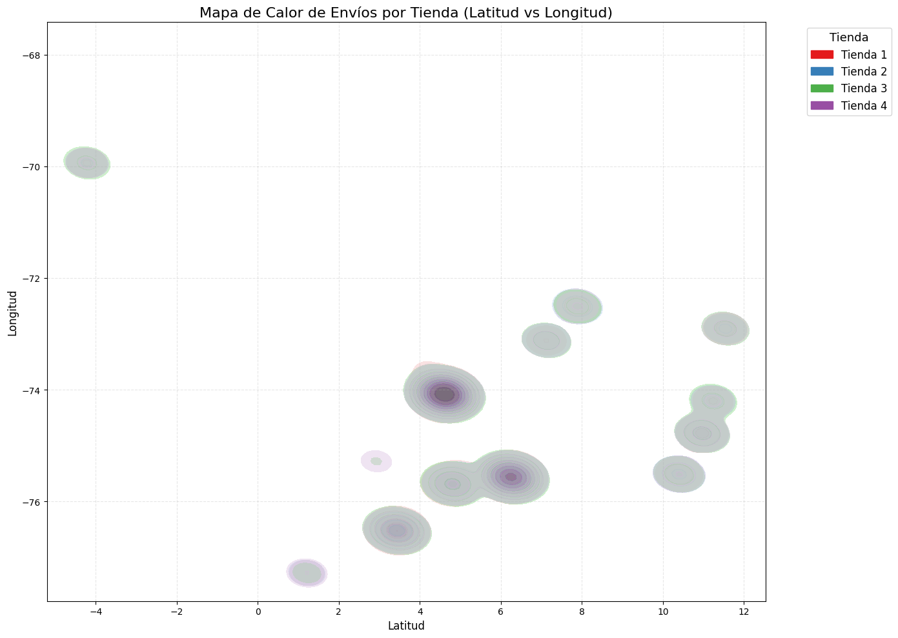
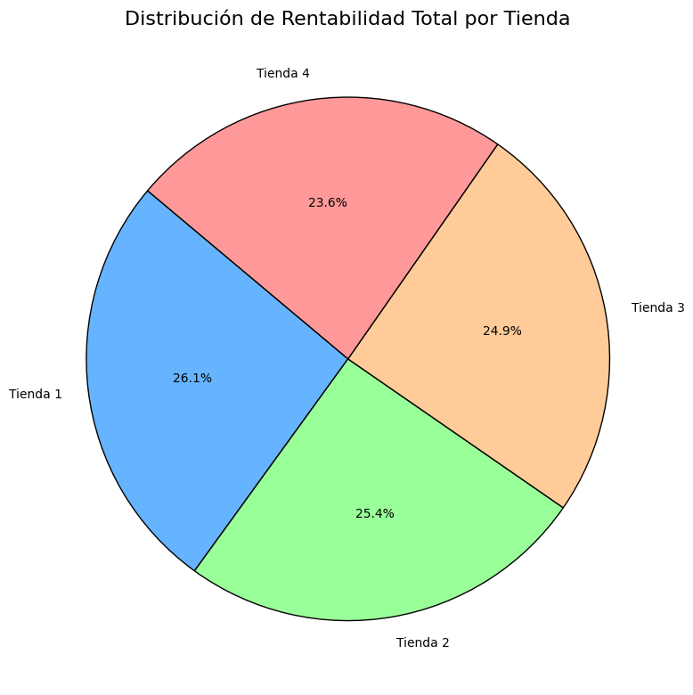
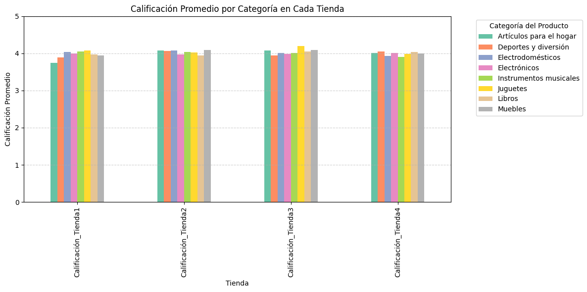

# challenge-alura-store

# 🛍️ Análisis de Ventas por Tienda

Este proyecto forma parte del curso **"Modelado de datos con Python"** impartido por **Alura LATAM** dentro del programa **Oracle Next Education (ONE)**.

El ejercicio consiste en **analizar los datos de ventas de cuatro tiendas** a partir de archivos `.csv`, y con base en el análisis, **sugerir cuál de las tiendas debería cerrar** para dar inicio a un nuevo emprendimiento.

---

## 📂 Estructura del Repositorio

    ├── base-de-datos-challenge1-latam/
    │ ├── tienda1.csv
    │ ├── tienda2.csv
    │ ├── tienda3.csv
    │ └── tienda4.csv
    ├── notebooks/
    │ ├── analisis_tiendas.ipynb
    ├── imagenes/
    │ ├── calificacion.png
    │ ├── calor.png
    │ ├── rentabilidad de cada tienda en el tiempo.png
    │ └── torta.png
    └── README.md

## 📊 Objetivos del Proyecto

- Cargar datos de ventas desde archivos `.csv`
- Limpiar y transformar los datos
- Analizar ventas por categoría
- Calcular promedios de gastos por categoría
- Visualizar resultados de forma clara e intuitiva

---

## 🧪 Cómo Ejecutar el Proyecto

1. Clona este repositorio:
   ```bash
   git clone https://github.com/Akiri12/challenge-alura-store.git
   cd challenge-alura-store
2. Abre el notebook en Google Colab desde el archivo notebooks/analisis_tiendas.ipynb.

3. Asegúrate de que los archivos .csv estén disponibles en tu entorno.

4. Ejecuta celda por celda para ver el análisis.


---

## 📈 Resultados principales

Tras haber estudiado las ventas de las 4 tiendas se puede observar que todas hacen envíos prácticamente a los mismos sitios como se puede observar en este gráfico de calor:




Por otro lado, las líneas de tendencia muestran que tanto las tiendas 1 y 4 presentan una caída en su rentabilidad en el tiempo, siendo esta última la peor de las dos. 


Adicional a lo anterior, la tienda 4 es la que aporta menos a la rentabilidad total de las 4 tiendas como se puede observar en este gráfico de torta. 



Por último, podemos ver que la tienda 1 tiene calificaciones menores que las otras tiendas.


## Conclusiones

1. Debería considerarse cerrar la tienda 4, ya que es la que menos aporta en ventas y tiene una rentabilidad decreciente en el tiempo.
2. Dado que los gráficos de calor muestran que en el cuadrante lat 5 long -75 tiene una zona con un volumen de ventas muy alto debería considerarse abrir una nueva tienda en esa zona, lo que podría aumentar ventas y disminuir costos de despacho.
3. La tienda 1, pese a su rendimiento deficiente, aporta el mayor porcentaje de rentabilidad. Se recomienda intervenirla eliminando del catálogo productos de bajo desempeño y capacitando al personal para mejorar la capacitación de los mismos. 
